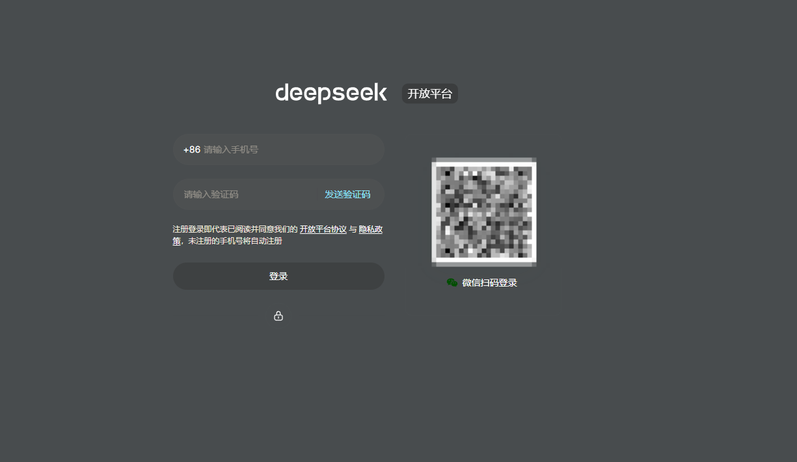
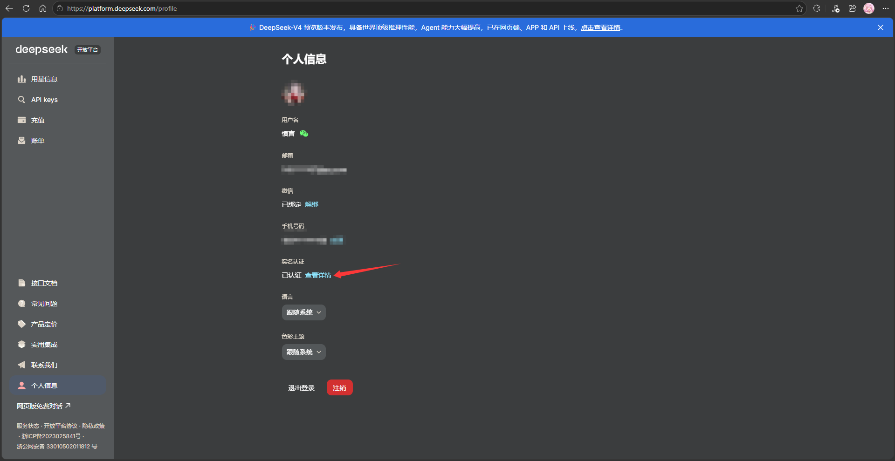
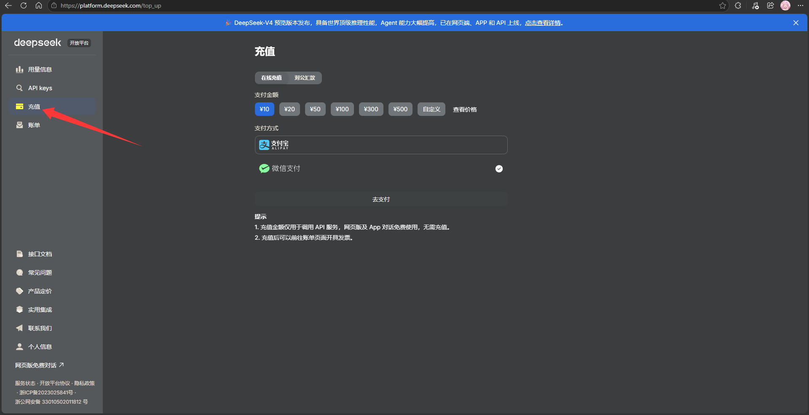
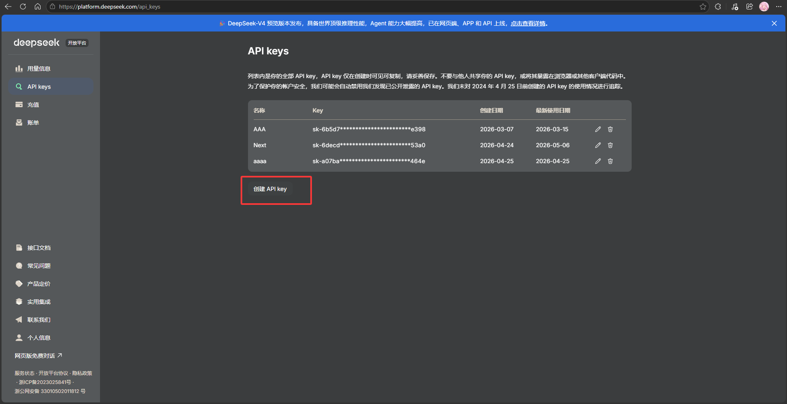
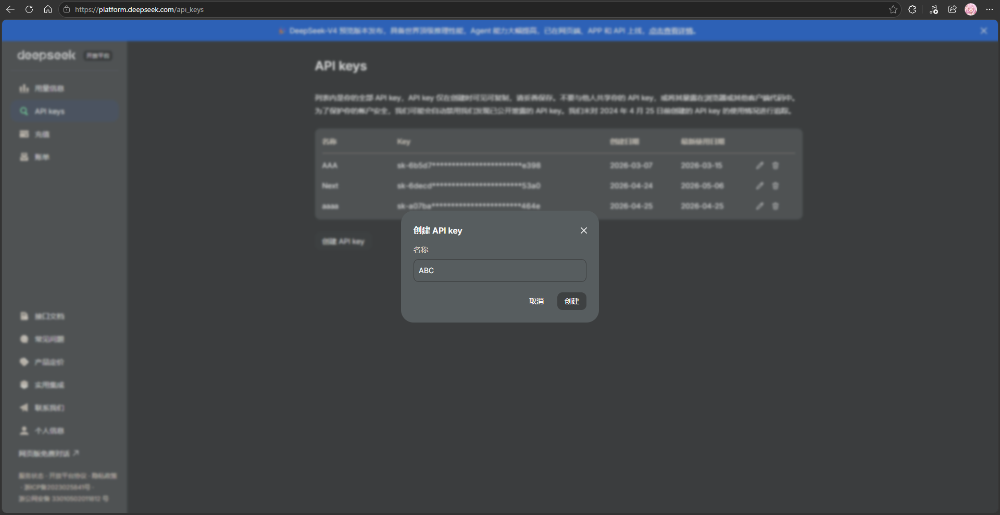
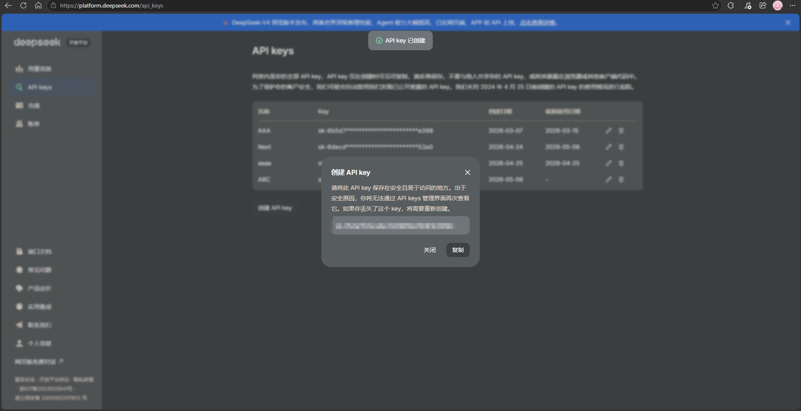

# DeepSeek API Key 申请教程

这篇教程用于解决“还没有 API Key，不知道去哪里申请”的问题。示例平台是 DeepSeek 开放平台：

https://platform.deepseek.com/

> API Key 相当于你的付费调用密码。创建后一定要保存好，不要发给别人，不要截图公开，不要贴到群里或 Issue 里。别人拿到你的 Key 后可以消耗你的账户余额，也就是会直接扣你的钱。

## 1. 登录 DeepSeek 开放平台

打开 DeepSeek 开放平台后，可以使用手机号验证码登录，也可以使用微信扫码登录。未注册过的手机号会按平台流程自动注册。

  
   
  图 1：进入 DeepSeek 开放平台，使用手机号验证码或微信扫码登录。

## 2. 完成实名认证

登录后进入左侧的 **个人信息** 页面，检查 **实名认证** 状态。如果还没有认证，点击旁边的 **查看详情**，按页面提示完成认证。

DeepSeek API 是按量计费服务，通常需要完成账号认证后再创建和使用 API Key。认证过程以 DeepSeek 页面实际要求为准。

  
   
  图 2：在个人信息页查看实名认证状态，未认证时按提示完成认证。

## 3. 充值 API 余额

点击左侧的 **充值**，选择充值金额和支付方式。第一次只是测试或翻译少量内容时，通常充值 `10` 元就可以用很久；后续如果翻译量变大，再按实际消耗继续充值。

注意：这里充值的是 API 服务余额，用于第三方工具调用 DeepSeek API。DeepSeek 网页版或 App 的免费对话是否需要充值，以 DeepSeek 当前页面说明为准。

  
   
  图 3：进入充值页，少量使用建议先充 10 元测试。

## 4. 进入 API keys 页面

点击左侧的 **API keys**，进入密钥管理页面。这里会列出你已经创建过的 API Key，但已创建的 Key 通常只会显示脱敏后的部分字符，不能重新查看完整内容。

点击 **创建 API key** 开始创建新的密钥。

  
   
  图 4：进入 API keys 页面，点击创建 API key。

## 5. 填写 API Key 名称

创建时需要填写一个名称。这个名称只用于你自己区分用途，例如 `AiNiee`、`AiNiee-Next`、`Novel-Translate` 等，不影响实际调用。

填写后点击 **创建**。

  
   
  图 5：填写一个方便自己识别的名称，然后创建。

## 6. 复制并保存 API Key

创建成功后，页面会弹出完整的 API Key。请立刻点击 **复制**，并把它保存到你自己的安全位置，例如密码管理器或本地加密笔记。

这个 Key 一定要保存好。关闭弹窗后，DeepSeek 通常不会再完整显示这串 Key；如果你忘记保存，只能删除旧 Key 后重新创建。

  
   
  图 6：创建成功后立即复制完整 API Key，并保存到安全位置。

## 7. 安全提醒

- 不要把 API Key 发给任何人。
- 不要把 API Key 截图发到群里、论坛、Issue、工单或聊天记录里。
- 不要把 API Key 写进公开仓库、公开文档或公开脚本。
- 如果怀疑 Key 已经泄露，立刻到 DeepSeek 的 **API keys** 页面删除这个 Key，再创建新的 Key。
- 如果余额异常减少，先检查 **账单** 和 API Key 使用情况，再停用可疑 Key。

## 8. 填入 AiNiee-Next

回到 AiNiee-Next 的快速设置向导或 **API 配置** 页面，选择 DeepSeek 后填写：

- `API Key`：粘贴刚才复制的 DeepSeek API Key。
- `模型名称`：可以先使用项目预设里的 DeepSeek 模型；如果 DeepSeek 平台更新了模型名称，请以平台最新说明为准。
- `API 地址`：项目预设通常会自动填写 `https://api.deepseek.com/v1`，一般不需要手动改。

填好后建议先选择 **验证当前 API**。验证成功后，再继续配置项目路径、语言、提示词并开始翻译。
