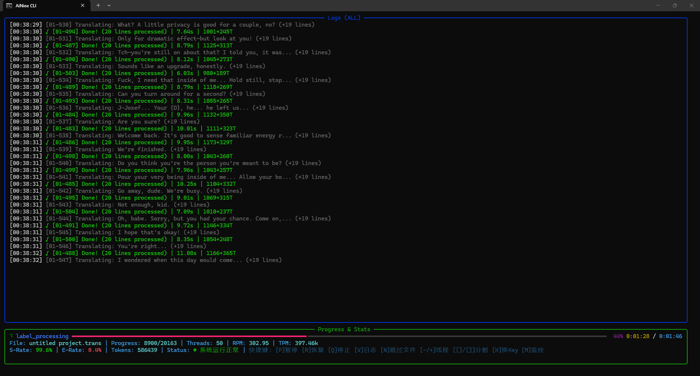

# AiNiee-Next

<div align="center">
  
  
  
</div>

<br/>

[English](README_EN.md) | [简体中文](README.md)

**AiNiee-Next** 是针对 [AiNiee](https://github.com/NEKOparapa/AiNiee) 核心逻辑进行工程化重构的命令行版本。

本项目引入了现代化的 Python 包管理工具 **uv**，并对底层运行时进行了多项稳定性优化。通过接管底层 IO 流与异常处理，构建了一个适合长时间挂机、服务器部署及自动化工作流的高健壮性 TUI 环境。

---

## 性能展示

**本项目为极致的性能释放和稳定性而生。**

下图展示了一个约 20,000 行的待翻译文件，在 50 并发线程下仅用约 4 分钟即可完成翻译任务：

<div align="center">
  
  <br>
  <em>50 并发 + DeepSeek API | 20k 行 | ~4 分钟完成 | 99.6% 成功率 | 397k TPM</em>
</div>

---

## 核心特性

### 运行时稳定性
- **IO 流清洗与接管**：重构标准输出流捕获逻辑，屏蔽底层依赖库冗余日志，防止 TUI 界面撕裂或崩溃
- **智能错误恢复**：内置异常拦截与自动重试机制，支持断点续传，适合长时间挂机运行
- **跨平台兼容**：支持 Windows / Linux / macOS / Android (Termux)，Headless 服务器友好

### 智能格式处理
- **全自动格式转换**：支持 .mobi / .azw3 / .kepub / .fb2 等格式的"识别 - 转换 - 翻译 - 还原"闭环
- **多格式原生支持**：Epub、Docx、Txt、Srt、Ass、Vtt、Lrc、Json、Po、Paratranz 等 20+ 格式
- **Calibre 中间件集成**：自动调用 Calibre 处理复杂电子书格式

### 实时任务控制中心
- **动态并发调整**：通过 `+` / `-` 键实时增减并发线程数
- **API Key 热切换**：通过 `K` 键强制触发 API Key 轮换，应对限流
- **任务中途监控**：通过 `M` 键启动 WebServer 并自动打开浏览器
- **系统状态监控**：底部状态栏实时显示运行状态，边框颜色联动
- **成本与时间预估**：任务启动前自动预估 Token 消耗、API 费用及完成时间

### 多配置文件系统
- **Profile 隔离存储**：支持创建、克隆、切换多套配置方案
- **场景化配置**：可区分"快速翻译"与"精细润色"等不同场景
- **配置热重载**：修改配置后无需重启即可生效

### 插件化架构
- **模块化扩展**：无需修改核心代码即可安全扩展功能
- **内置 RAG 插件**：自动检索历史译文，为长篇内容提供上下文参考，提升术语和风格一致性
- **翻译检查插件**：自动检测漏译、错译、格式异常等问题
- **集中化管理**：CLI 主菜单和 Web UI 均提供插件管理页面

### 智能任务队列
- **批量任务配置**：预先配置多个不同文件或翻译策略的任务
- **动态队列调度**：支持拖拽排序（Web）和键盘交互重排（TUI）
- **任务热修改**：队列执行中可实时修改待处理任务参数
- **自动顺序执行**：适合大批量翻译工作流

### 上下文缓存
- **多平台支持**：Anthropic / Google / Amazon Bedrock 上下文缓存
- **费用优化**：缓存系统提示词和术语表，显著降低 API 调用费用
- **智能降级**：自动检测 API 兼容性，不支持时自动关闭并提示

### 思考模式增强
- **全平台兼容**：支持所有主流在线 API 平台及第三方中转站
- **智能参数配置**：为在线 API 和本地模型提供不同的兼容性提示
- **深度推理支持**：支持 DeepSeek R1、Claude 3.5 等模型的深度思考模式

### API 故障转移
- **多 API 池管理**：支持配置多个备用 API
- **自动切换**：主 API 失败时自动切换到备用 API
- **阈值控制**：可配置故障转移触发阈值

### 高并发性能释放
- **异步请求模式**：基于 aiohttp 的异步 I/O，突破线程池瓶颈，支持 100+ 并发
- **智能错误分类**：区分"硬伤错误"（格式/认证问题）与"软伤错误"（限流/超时），硬伤不重试，软伤智能等待
- **Provider 指纹记录**：自动检测并记录各 API 的功能支持情况，下次启动静默降级
- **信号量保护**：高并发时保护本地系统资源（文件描述符、端口数），确保稳定运行
- **自动提示**：当并发数 ≥15 时，自动建议启用异步模式以获得更好性能

---

## 快速开始

### 方式一：一键启动（推荐）

**1. 获取代码**
```bash
git clone https://github.com/ShadowLoveElysia/AiNiee-Next.git
cd AiNiee-Next
```

**2. 环境准备（首次运行）**

Windows:
```batch
双击 prepare.bat
```

Linux / macOS:
```bash
chmod +x prepare.sh && ./prepare.sh
```

**3. 启动应用**

Windows:
```batch
双击 Launch.bat
```

Linux / macOS:
```bash
./Launch.sh
```

---

### 方式二：手动配置

**1. 安装 uv**

Windows (PowerShell):
```powershell
powershell -c "irm https://astral.sh/uv/install.ps1 | iex"
```

Linux / macOS:
```bash
curl -LsSf https://astral.sh/uv/install.sh | sh
```

Android (Termux):
```bash
pkg update && pkg upgrade
pkg install python
pip install uv
```

**2. 获取代码并启动**
```bash
git clone https://github.com/ShadowLoveElysia/AiNiee-Next.git
cd AiNiee-Next
uv run ainiee_cli.py
```

---

## 命令行参数

支持通过命令行参数直接启动任务，适用于脚本集成与自动化。

**翻译任务示例：**
```bash
uv run ainiee_cli.py translate input.txt -o output_dir -p MyProfile -s Japanese -t Chinese --resume --yes
```

**队列任务示例：**
```bash
uv run ainiee_cli.py queue --queue-file my_queue.json --yes
```

**MCP 服务示例：**
```bash
uv run ainiee_cli.py mcp --mcp-transport stdio
```

**主要参数：**
- `translate` / `polish` / `export` / `queue` / `mcp`: 任务类型
- `-o, --output`: 输出路径
- `-p, --profile`: 配置 Profile 名称
- `-s, --source`: 源语言
- `-t, --target`: 目标语言
- `--type`: 项目类型 (Txt, Epub, MTool, RenPy 等)
- `--resume`: 自动恢复缓存任务
- `--yes`: 非交互模式
- `--threads`: 并发线程数
- `--platform`: 目标平台
- `--model`: 模型名称
- `--api-url`: API 地址
- `--api-key`: API 密钥
- `--mcp-transport`: MCP 传输模式，可选 `stdio` / `streamable-http` / `sse`

---

## Web 控制面板

本项目集成基于 React 构建的 Web 控制面板，已进入稳定阶段。

**启动方式：**
1. 运行 `uv run ainiee_cli.py` 进入主菜单
2. 选择 **15. Start Web Server**
3. 程序将自动启动服务（默认端口 8000）并打开浏览器

**功能：**
- 可视化看板：实时图表展示 RPM、TPM 及任务进度
- 网络访问：支持局域网远程监控
- 配置管理：网页端创建、切换配置 Profile
- 队列管理：拖拽排序、实时编辑任务参数
- 插件中心：启用/禁用 RAG 等高级功能

> **开发说明**：Web 控制面板已稳定运行，但功能相对 TUI 模式较少。本项目以 CLI/TUI 交互为核心开发方向，Web 端功能更新将在后续版本中逐步跟进。

---

## MCP 服务

本项目提供可选的 MCP 服务模块，复用现有 WebServer 后端能力，并尽量覆盖全部 Web API 路由，以便在 MCP 客户端中获得接近 Web 面板的操作体验。

**启动方式：**
1. 命令行直启：`uv run ainiee_cli.py mcp --mcp-transport stdio`
2. 主菜单启动：进入主菜单后选择 **16. 启动 MCP 服务**

**说明：**
- MCP 服务是可选组件，缺失时不会影响主程序其他功能
- 每次启动 MCP 前都会检查必要组件与依赖
- 若缺少依赖，程序会提示可执行的 `uv add ...` 命令
- 菜单启动默认使用后台 `streamable-http` 模式，等待 3 秒后返回菜单
- 如果修改了 `mcp_server_port`，请同步更新 MCP 客户端中的连接路由

**客户端接入示例：**
1. Codex 通过 `stdio` 直连，推荐直接使用项目内置 launcher：

```bash
codex mcp add ainiee-cli -- /path/to/AiNiee-CLI/Tools/MCPServer/codex_stdio_launcher.sh
```

首次启动如果依赖尚未缓存，建议在 `~/.codex/config.toml` 中给该 MCP 增加较大的超时，例如：

```toml
[mcp_servers.ainiee-cli]
startup_timeout_sec = 90
```

2. 如果你想手写原始命令，推荐使用隔离模式，避免误碰项目 `.venv`：

```bash
uv run --python /usr/bin/python3 --isolated --no-project --quiet --with mcp --with fastapi --with 'uvicorn[standard]' --with requests python /path/to/AiNiee-CLI/Tools/MCPServer/server.py --transport stdio
```

3. 支持 `streamable-http` 的 MCP 客户端，可直接连接菜单启动后的 HTTP 路由：

```text
本机地址: http://127.0.0.1:8765/mcp
局域网地址: http://<你的局域网IP>:8765/mcp
```

4. Windows 项目路径示例：

```text
H:\小说\AiNiee-CLI\Tools\MCPServer\server.py
```

如果你把 `mcp_server_port` 改成了其他值，上面的 `8765` 也要同步替换。
如果项目目录里的 `.venv` 曾经在另一套系统下创建过，例如 WSL 生成后又在 Windows 下执行 `uv add`，建议先重建 `.venv`，否则容易出现 `lib64` / 符号链接相关报错。

---

## 架构说明

本项目采用 Wrapper / Adapter 模式：

- **Core**: 保持原版 AiNiee 的核心业务逻辑
- **Adapter Layer**: `ainiee_cli.py` 作为防腐层，负责环境隔离与异常拦截
- **Runtime**: 由 uv 托管，确保依赖环境一致性

---

## 漫画处理参考

本项目在漫画图像处理相关能力的设计与规划中，参考了 **hgmzhn / manga-translator-ui** 的实现与工作流：

- GitHub: https://github.com/hgmzhn/manga-translator-ui
- Gitee 备份: https://gitee.com/hgmzhn/manga-translator-ui

后续若参考、接入或复用相关核心模块，本项目会持续保留来源说明与鸣谢信息，并遵守对应开源协议。

---

## 免责声明

- 本项目是 AiNiee 的非官方优化分支，侧重于运行体验与工程稳定性
- 核心翻译算法与原版保持一致，请遵守原版使用协议
- 本工具仅供个人学习与合法用途使用

---

<div align="center">
  Made by ShadowLoveElysia
  <br>
  Based on the original work by NEKOparapa
</div>
