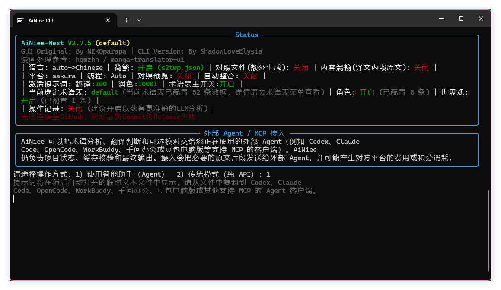
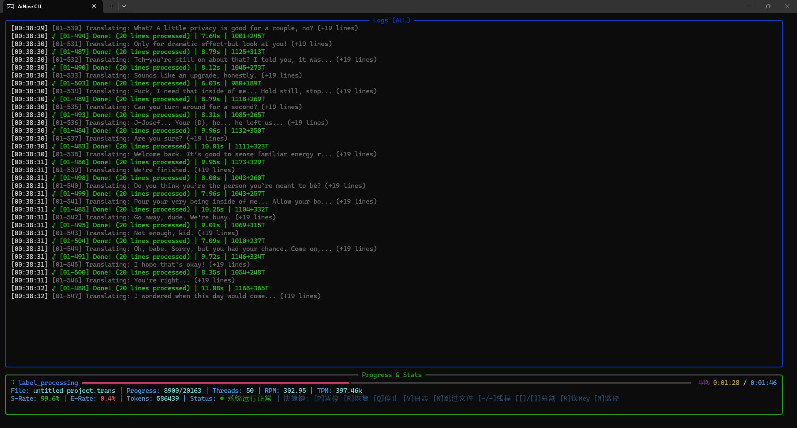

# AiNiee-Next

<div align="center">
  
  
  
</div>

<br/>

[简体中文](README.md) | [English](README_EN.md) | [繁體中文](Docs/README_zh_CNTW.md) | [日本語](Docs/README_JA.md) | [한국어](Docs/README_KO.md) | [Русский](Docs/README_RU.md) | [Español](Docs/README_ES.md)

**AiNiee-Next** is a command-line edition built on the core translation logic of [AiNiee](https://github.com/NEKOparapa/AiNiee). It uses **uv** to manage the Python environment and includes extensive improvements for long-running jobs, batch processing, server deployments, and automation.

CLI/TUI is the primary interface, with a Web dashboard, task queues, plugins, and an MCP server also available. The project is suitable for personal translation, long-form content, and unattended batch jobs.

[Download the latest source ZIP](https://github.com/ShadowLoveElysia/AiNiee-Next/archive/HEAD.zip) — Get a complete source snapshot of the default branch's latest commit. Extract the archive first. On Windows, open the extracted project folder and run `prepare.bat`, then `Launch.bat`.

<a id="agent-mode"></a>

## Recommended for Beginners: External Agent Mode

If you are a complete beginner or want to start translating with less setup, choose **Smart assistant (Agent)**. You can use WorkBuddy, Qwen Office, Doubao Desktop, or another standard Agent client or framework that supports MCP to process files through AiNiee, without first completing the traditional API setup wizard.

You can translate using a third-party Agent platform's **free** quota where available. Availability, quota size, and eligible models depend on the platform's current rules and your account.

1. Prepare the environment and launch AiNiee-Next using [Quick Start](#quick-start) below.
2. On the first run, choose your interface language, then **1. Smart assistant (Agent)**.
3. A temporary text file will open. Copy its **entire prompt** into WorkBuddy, Qwen Office, Doubao Desktop, or another MCP-capable Agent and let it follow the connection instructions.
4. Once the Agent can call AiNiee MCP tools, provide your file or its full path and specify the target language.

<p align="center">
  
  <br>
  <sub>Select option 1, then copy the entire prompt from the temporary text file into your external Agent.</sub>
</p>

**Enable SubAgent mode if your client supports it**, so the main Agent can coordinate translation work with subagents. After connecting, you can say:

```text
Enable SubAgent mode to translate this book, xxxx.epub, into Simplified Chinese. Use AiNiee-Next MCP to process the file.
```

Replace `xxxx.epub` with your uploaded file or its full path. SubAgent support depends on the third-party client; the main Agent can still translate through MCP when subagents are unavailable.

To configure models, API keys, and translation parameters yourself, read the [Traditional API Quick Start Guide](Docs/README_QUICK_START_EN.md).

---

## Diagnostics and Issue Reporting

When a task fails, the program collects the stack trace, runtime environment, API provider, model, and recent operations. Built-in rules and optional LLM analysis then help determine whether the problem comes from the API, network, configuration, runtime environment, or project code. Suspected code issues can also be organized into a GitHub Issue with the error description, environment details, key traceback, and initial analysis.

---

## Performance Showcase

**Built for ultimate performance and stability.**

The screenshot below demonstrates a ~20,000 line file being translated in approximately 4 minutes with 50 concurrent threads:

<div align="center">
  
  <br>
  <em>50 Threads + DeepSeek API | 20k Lines | ~4 min | 99.6% Success Rate | 397k TPM</em>
</div>

---

## Key Features

- **Reliable execution and recovery**: Cleans up low-level I/O output to keep dependency logs from disrupting the TUI, with exception handling, automatic retries, and checkpoint resume for long-running jobs.
- **Cross-platform support**: Runs on Windows, Linux, macOS, and Android (Termux), including headless server environments.
- **Broad format support**: Handles more than 20 formats, including Epub, Docx, Txt, Srt, Ass, Vtt, Lrc, Json, Po, and Paratranz. Calibre integration also supports ebooks such as `.mobi`, `.azw3`, `.kepub`, and `.fb2`.
- **Task and configuration management**: Adjust concurrency and rotate API keys during a run, open Web monitoring, and review task status, cost, and completion-time estimates. Multiple profiles, hot-reloaded settings, and reorderable batch queues are supported; pending tasks can be edited while the queue runs and are executed automatically in order.
- **Plugins and translation assistance**: Extend the program through centrally managed plugins, use previous translations through RAG, and check for missing translations, translation errors, and formatting problems.
- **Context caching**: Supports context caching for Anthropic, Google, and Amazon Bedrock, including system prompts and glossaries. The feature is disabled with a notice when the current API is incompatible.
- **Model and API support**: Works with major online APIs, third-party gateways, and local models, with relevant parameter guidance for each interface type. Reasoning models such as DeepSeek R1 and Claude 3.5 are supported, along with multiple API endpoints, automatic failover, and configurable failover thresholds.
- **High-concurrency processing**: The aiohttp-based async mode supports more than 100 concurrent requests, distinguishes permanent errors from temporary failures, records provider compatibility, and protects system resources such as file descriptors and ports. At 15 or more concurrent requests, the program suggests enabling async mode.
- **Web, MCP, and MangaCore**: The Web dashboard provides visual task management, MCP offers controlled access for LLM clients, and MangaCore supports automatic manga batch processing and Web-based editing.

---

## Quick Start

> Complete beginners and users who want less setup should start with [External Agent Mode](#agent-mode). For traditional API mode, read the [Quick Start Guide](Docs/README_QUICK_START_EN.md) and [DeepSeek API Key Guide](Docs/DEEPSEEK_API_KEY_EN.md). For translation quality, prompts, glossary, polishing, WebUI, and MCP guidance, read the [Advanced Settings Guide](Docs/TRANSLATION_WORKFLOW_GUIDE_EN.md).

### Method 1: One-Click Launch (Recommended)

**1. Get the Code**

Beginners can [download the latest source ZIP](https://github.com/ShadowLoveElysia/AiNiee-Next/archive/HEAD.zip), extract it, and open the project folder containing `prepare.bat` and `Launch.bat`. Then continue to step 2.

If you are familiar with Git, you can clone the project for easier updates:

```bash
git clone https://github.com/ShadowLoveElysia/AiNiee-Next.git
cd AiNiee-Next
```

**2. Environment Setup (First Run)**

Windows:
```batch
Double-click prepare.bat
```

Linux / macOS:
```bash
chmod +x prepare.sh && ./prepare.sh
```

**3. Launch Application**

Windows:
```batch
Double-click Launch.bat
```

Linux / macOS:
```bash
./Launch.sh
```

---

### Method 2: Manual Configuration

**1. Install uv**

Windows (PowerShell):
```powershell
powershell -c "irm https://astral.sh/uv/install.ps1 | iex"
```

Linux / macOS:
```bash
curl -LsSf https://astral.sh/uv/install.sh | sh
```

Android (Termux):
```bash
pkg update && pkg upgrade
pkg install python
pip install uv
```

**2. Get the Code and Launch**
```bash
git clone https://github.com/ShadowLoveElysia/AiNiee-Next.git
cd AiNiee-Next
uv run ainiee_cli.py
```

---

## Command-Line Arguments

Supports launching tasks directly via command-line arguments for script integration and automation.

**Translation Task Example:**
```bash
uv run ainiee_cli.py translate input.txt -o output_dir -p MyProfile -s Japanese -t Chinese --resume --yes
```

**Queue Task Example:**
```bash
uv run ainiee_cli.py queue --queue-file my_queue.json --yes
```

**MCP Server Example:**
```bash
uv run ainiee_cli.py mcp --mcp-transport stdio
```

**Main Arguments:**
- `translate` / `polish` / `export` / `queue` / `mcp`: Task type
- `-o, --output`: Output path
- `-p, --profile`: Configuration profile name
- `-s, --source`: Source language
- `-t, --target`: Target language
- `--type`: Project type (Txt, Epub, MTool, RenPy etc.)
- `--resume`: Auto-resume cached tasks
- `--yes`: Non-interactive mode
- `--threads`: Concurrent thread count
- `--platform`: Target platform
- `--model`: Model name
- `--api-url`: API URL
- `--api-key`: API Key
- `--mcp-transport`: MCP transport mode, supports `stdio` / `streamable-http` / `sse`

---

## Web Dashboard

This project includes a React-based Web Dashboard, now in stable release.

**How to Start:**
1. Run `uv run ainiee_cli.py` to enter the main menu
2. Select **15. Start Web Server**
3. The program will start the service (default port 8000) and open your browser

**Features:**
- Visual Dashboard: Real-time RPM, TPM, and task progress charts
- Network Access: Remote monitoring via LAN IP
- Profile Management: Create and switch profiles from web UI
- Queue Management: Drag-and-drop task reordering
- Plugin Center: Enable/disable RAG and other features

> **Development Note**: The Web Dashboard is now stable, but has fewer features compared to TUI mode. This project focuses on CLI/TUI interaction as the core development direction. Web features will be gradually updated in future releases.

---

## MCP Server

This project provides an optional MCP server module that reuses the existing WebServer backend and aims to cover the full Web API surface, so MCP clients can get an experience close to the Web dashboard.
Any LLM client that supports MCP over `stdio` or `streamable-http` can connect to this project directly, without reading repository files or manually assembling Web API calls.

**Startup Options:**
1. Direct CLI: `uv run ainiee_cli.py mcp --mcp-transport stdio`
2. Main menu: open the main menu and select **16. Start MCP Server**

**Notes:**
- The MCP server is optional and does not affect the main process when missing
- Required components and Python dependencies are checked on every MCP startup
- If dependencies are missing, the program shows complete install commands for the current system
- Menu startup uses background `streamable-http` mode and returns to the menu after 3 seconds
- If you change `mcp_server_port`, update the MCP route in your client as well

**Direct LLM client integration:**
1. MCP clients that support `stdio` can launch AiNiee CLI as a local MCP server.
If your client uses a `command + args` configuration format, this generic template can be used as a reference:

```json
{
  "mcpServers": {
    "ainiee-cli": {
      "command": "uv",
      "args": [
        "run",
        "--directory",
        "H:\\小说\\AiNiee-CLI",
        "--isolated",
        "--no-project",
        "--quiet",
        "--with",
        "mcp",
        "--with",
        "fastapi",
        "--with",
        "uvicorn[standard]",
        "--with",
        "requests",
        "python",
        "Tools/MCPServer/server.py",
        "--transport",
        "stdio"
      ]
    }
  }
}
```

Different clients may use slightly different field names, but the core idea is the same: `command=uv` plus the `args` shown above.
Replace the path with your own project directory. On Linux / macOS, replace `H:\\小说\\AiNiee-CLI` with `/path/to/AiNiee-CLI`.

2. If your client only accepts a raw command, use:

```bash
uv run --directory /path/to/AiNiee-CLI --isolated --no-project --quiet --with mcp --with fastapi --with uvicorn[standard] --with requests python Tools/MCPServer/server.py --transport stdio
```

3. Codex over `stdio`, preferably via the bundled launcher:

```bash
codex mcp add ainiee-cli -- /path/to/AiNiee-CLI/Tools/MCPServer/codex_stdio_launcher.sh
```

If this is the first startup and dependencies are not cached yet, add a larger timeout in `~/.codex/config.toml`, for example:

```toml
[mcp_servers.ainiee-cli]
startup_timeout_sec = 90
```

4. MCP clients that support `streamable-http` can connect directly to the MCP HTTP route exposed by AiNiee CLI.
Start it first with:

```bash
uv run ainiee_cli.py mcp --mcp-transport streamable-http
```

or from the main menu with **16. Start MCP Server**.

If the client uses a URL-style configuration, this is a valid reference:

```json
{
  "mcpServers": {
    "ainiee-cli": {
      "transport": "streamable-http",
      "url": "http://127.0.0.1:8765/mcp"
    }
  }
}
```

Endpoints:

```text
Local endpoint: http://127.0.0.1:8765/mcp
LAN endpoint: http://<your-lan-ip>:8765/mcp
```

5. If MCP startup reports missing dependencies, run this from the project root:

```bash
set "UV_PROJECT_ENVIRONMENT=%CD%\.venv-win" && uv --directory "%CD%" add "mcp" "fastapi" "uvicorn[standard]" "requests"
```

On Linux / macOS, use:

```bash
UV_PROJECT_ENVIRONMENT="$(pwd)/.venv" uv --directory "$(pwd)" add 'mcp' 'fastapi' 'uvicorn[standard]' 'requests'
```

If you change `mcp_server_port`, replace `8765` in the route above with the new port.
If the project `.venv` was created under another OS first, for example in WSL and then reused from Windows, recreate `.venv` before running `uv add` to avoid `lib64` / symlink related errors.

**Recommended first MCP calls for LLM clients:**
- `get_mcp_usage_manual`
- `get_mcp_security_policy`
- `get_mcp_tool_categories`
- `get_mcp_tool_catalog(category="<needed-category>")`
- `get_mcp_validation_checklist`

These tools tell the LLM what MCP capabilities are available, how tool parameters are structured, which routes are restricted, and why bypassing MCP is forbidden. The endpoint catalog is category-based by default, so clients do not need to inject every Web API endpoint into context at once.

**MCP security requirements:**
- The LLM must not bypass MCP by sending direct HTTP requests to the Web UI, localhost, or LAN ports
- The LLM must use MCP tools only for AiNiee operations
- `api_key` / `access_key` / `secret_key` are redacted on MCP reads
- MCP reads of sensitive config also return `_mcp_security_notice`, explicitly stating that the restriction is permission-based and that bypassing through any other channel is forbidden
- A redacted placeholder is not a usable secret and must not be written back as if it were real
- Sensitive Web API routes require a valid Web UI session cookie or MCP bridge token, so bare unauthenticated HTTP bypass requests are rejected

Full client-facing guide:
- `Tools/MCPServer/MCP_CLIENT_GUIDE.md`

---

## Architecture

This project utilizes a Wrapper / Adapter pattern:

- **Core**: Original AiNiee core business logic unchanged
- **Adapter Layer**: `ainiee_cli.py` handles environment isolation and exception interception
- **Runtime**: Managed by uv for dependency consistency

---

## Manga Reference

The MangaCore subsystem uses a layered design: fully automatic batch translation and manual page refinement are treated as separate workflows instead of being merged into one entry point.

**The fully automatic manga translation workflow** primarily references the workflow represented by `manga-translator-ui-main` and its upstream project **hgmzhn / manga-translator-ui**:

- GitHub: https://github.com/hgmzhn/manga-translator-ui
- Gitee mirror: https://gitee.com/hgmzhn/manga-translator-ui

This part mainly references its staged workflow and runtime asset organization: image/archive import, text detection, OCR, translation, inpainting, text rendering, and final export. In AiNiee-Next, this low-interaction batch workflow is carried by `translate ... --manga`, the Web task page Manga Mode, and the `MangaCore` batch pipeline.

**Manual refinement and manga editor logic** primarily references **mayocream / Koharu**:

- GitHub: https://github.com/mayocream/koharu

This part mainly references Koharu's manual refinement ideas, including project/page/text-block models, layered page states, current-page reruns, text block position and style adjustments, inpaint result inspection, and editable final exports.

If related core modules are referenced, integrated, or reused in later stages, this project will continue to preserve source attribution and acknowledgement, and will comply with the corresponding open-source license terms.

---

## Disclaimer

- This project is an unofficial optimized branch of AiNiee
- Core translation algorithms remain consistent with the original version
- This tool is intended for personal learning and legal use only

---

<div align="center">
  Made by ShadowLoveElysia
  <br>
  Based on the original work by NEKOparapa
</div>

### Workflow runtime parameters

Workflows accept per-run model, concurrency, context, quality switches, and step overrides while reusing configured interfaces. See [runtime parameter usage](Docs/WORKFLOW_RUNTIME_PARAMETERS.md).
