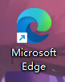
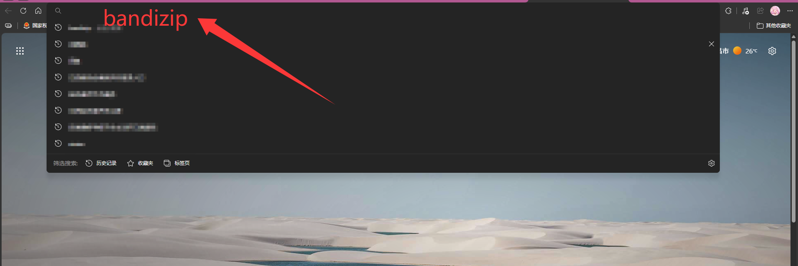
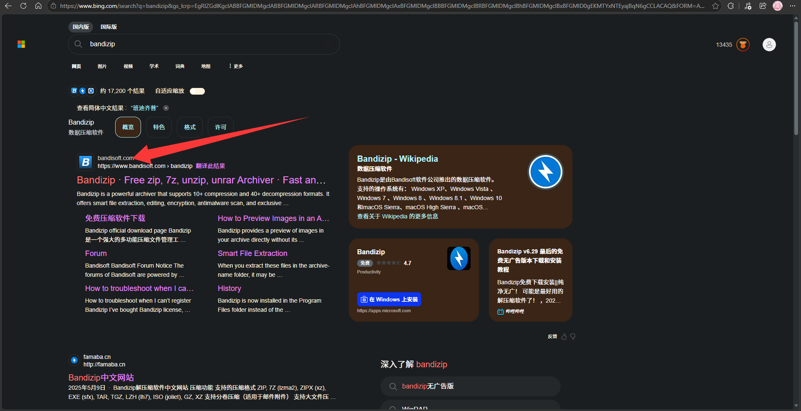
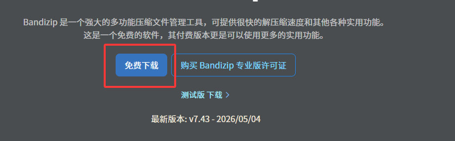
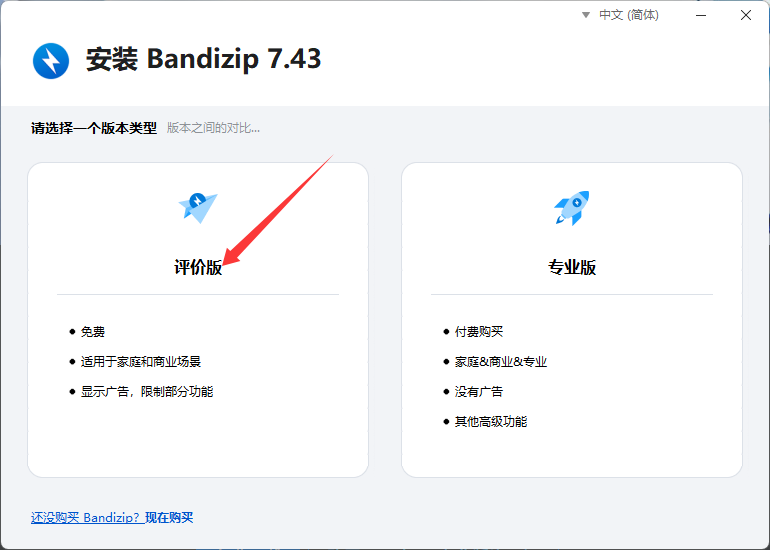
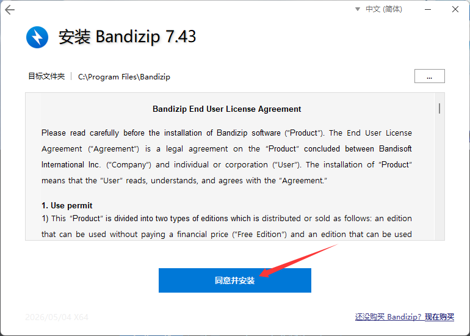
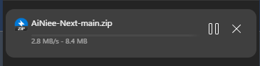
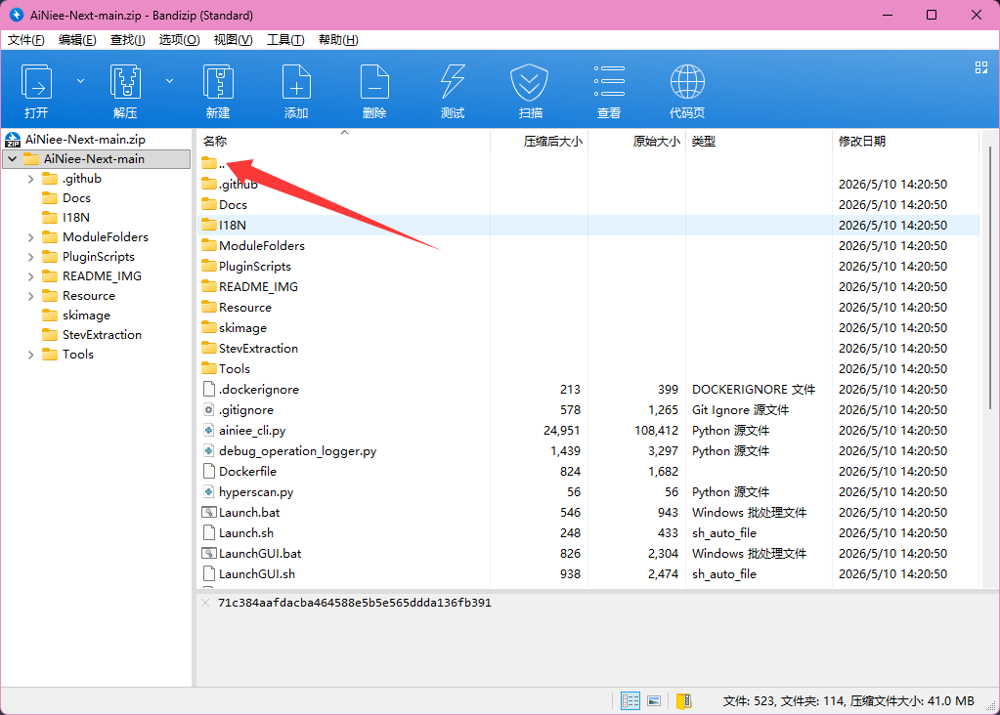
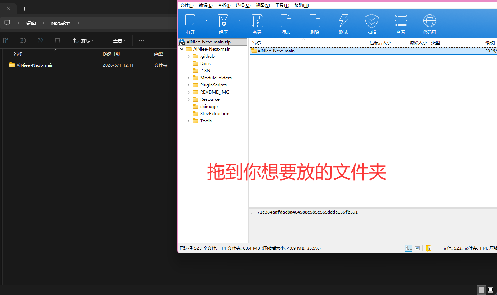

# 下载与解压教程

如果您不会下载和解压压缩包，可以按下面的步骤操作。

## 1. 打开浏览器

双击桌面上的浏览器图标，例如 Microsoft Edge。

  

## 2. 搜索 Bandizip

在浏览器地址栏输入 `bandizip`，然后按回车搜索。

  

搜索结果中选择 Bandizip 官方网站。

  

## 3. 下载并安装 Bandizip

进入 Bandizip 官方网站后，点击 **免费下载**。

  

安装时选择 **评价版**。

  

继续点击 **同意并安装**，等待安装完成。

  

## 4. 下载 AiNiee-Next 压缩包

下载完成后，可以在浏览器下载列表中看到 `AiNiee-Next-main.zip`。

  

## 5. 解压压缩包

双击打开 `AiNiee-Next-main.zip`，会进入 Bandizip。

  

把里面的 `AiNiee-Next-main` 文件夹拖到您想放的位置，例如桌面或其他专门存放软件的文件夹。拖出来后，解压就完成了。

  

解压完成后，进入 `AiNiee-Next-main` 文件夹，继续按照快速开始教程运行 `prepare.bat` 和 `Launch.bat`。
